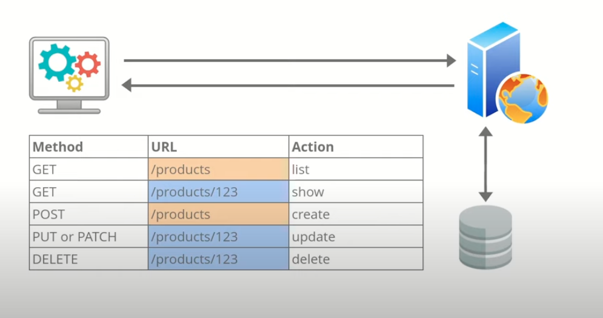

# Introduction



# Fichier de configuration .htacess
La configuration suivante dans ton fichier `.htaccess` :

```apache
RewriteEngine On
RewriteRule . index.php
```

signifie que **toutes les requêtes HTTP** adressées à ton application seront redirigées vers le fichier `index.php`, sauf si elles correspondent à un fichier ou répertoire existant (ce comportement dépend de la configuration complète du serveur, mais en général, c’est ce qui se passe).

Voici une explication ligne par ligne :

---

### `RewriteEngine On`

* Cela **active le moteur de réécriture d'URL** d'Apache (mod\_rewrite). C’est une condition préalable pour utiliser des règles de réécriture (`RewriteRule`).

---

### `RewriteRule . index.php`

* Cela signifie :

  * **`.`** : toute URL qui contient au moins un caractère (donc quasiment toutes les requêtes).
  * **`index.php`** : l’URL est réécrite en interne pour pointer vers `index.php`.

---

### Exemple :

Si un client appelle :

```
GET /api/users
```

et que le fichier `/api/users` **n’existe pas physiquement**, Apache va rediriger cette requête vers :

```
index.php
```

Et c’est dans `index.php` que tu devras analyser l’URL (`$_SERVER['REQUEST_URI']`) pour router la requête vers la bonne logique de traitement (`/api/users` → `UserController::index()` par exemple).


